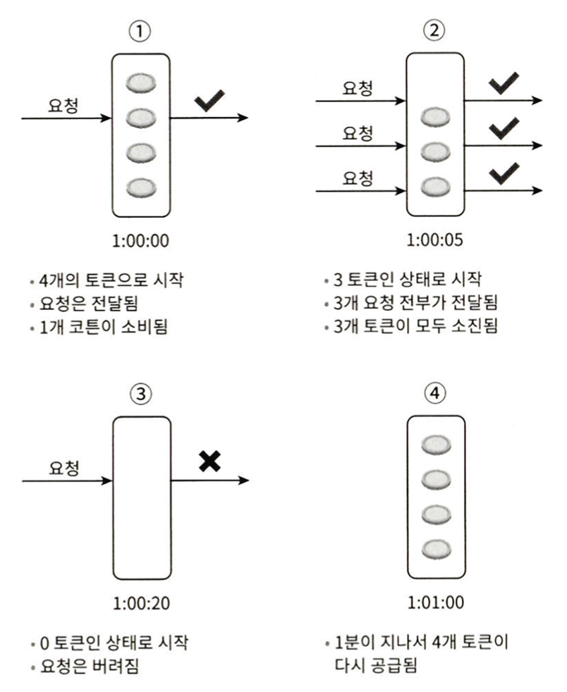
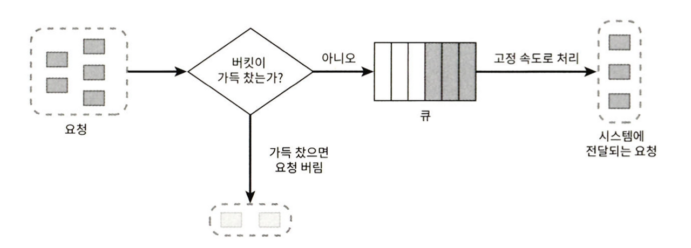
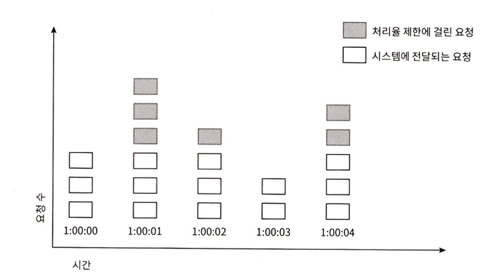

# chapter4. 처리율 제한 장치의 설계

`클라이언트 또는 서비스가 보내는 트래픽 처리율(rate)를 제거하기 위한 장치`

## \[1단계\] 문제 이해 및 설계 범위 확정(요구 사항 파악)

- 서버 측 API 를 위한 장치
- 다양한 제어 규칙
- 대규모 요청 처리
- 분산 환경
- 예외 처리

## \[2단계\] 개략적 설계안 제시 및 동의 구하기

### 처리율 제한 장치를 어디에 둘 것이가?

- 클라이언트 측 vs 서버 측
- API 서버 vs 게이트 웨이
    - 회사의 현재 기술 스택, 엔지니어링 인력, 우선 순위, 목표에 따라 구현 방향이 달라질 수 있다.

### 처리율 제한 알고리즘

#### 토큰 버킷

- 고려 사항
    - 버킷 크기: 버킷에 담을 수 있는 토큰의 최대 개수
    - 토큰 공급률: 초당 몇개의 토큰이 버킷에 공급되는가?
- 짧은 시간에 집중되는 트래픽 처리 가능(버킷에 남은 토큰이 있기만 하면 요청은 시스템으로 전달된다.)

#### 누출 버킷 알고리즘

- 요청 처리율이 고정되어 있다.
- 고려 사항
    - 버킷 크기: 큐 사이즈와 같다
    - 처리율: 지정된 시간당 몇개의 항목을 처리 할 것인가?
- 단시간에 몰리는 트래픽의 경우 큐에는 오래된 요청들이 쌓이게 되고, 제때 처리되지 못하면 최신 요청들이 버려지게 된다.

#### 고정 윈도 카운터 알고리즘

- 동작 방식
    - 타임 라인을 고정된 윈도로 나누고, 각 윈도마다 카운터를 붙인다.
    - 요청이 접수될 때마다 카운터 값 증가
    - 사전에 설정된 임계치에 도달하면 새로운 요청은 새 윈도가 열릴 때까지 버려진다.
- 윈도의 경계 부근에 트래픽이 집중될 경우, 윈도에 할당된 양보다 많은 요청이 처리될 수 있다는 것이 문제

#### 이동 윈도 로깅 알고리즘

- 동작 방식
    - 요청의 타임스템프 추적(Redis의 SortedSet 자료 구조 이용)
    - 새 요청이 오면 만료된 타임스템프 제거, 새 요청의 타임스템프를 log 에 추가
    - log의 크기가 허용치보다 같거나 작으면 요청을 시스템에 전달. 나머지는 처리를 거부

- 어느 순간의 윈도를 보더라도 허용되는 요청의 개수는 시스템의 처리율 한도를 넘지 않는다.
- 거부된 요청(1:00:50의 요청)의 타임스탬프로 보관하기 때문에 다량의 메모리를 사용.

#### 이동 윈도 카운터 알고리즘

- 고정 윈도 카운터 알고리즘 + 이동 윈도 로깅 알고리즘
- 이전 시간대의 평균 처리율에 따라 현재 윈도의 상태를 계산하므로 짧은 시간에 몰리는 트래픽에도 잘 대응한다.

### 개략적인 아키택처

- 고정 윈도 카운터 알고리즘 채택
- 카운터는 Redis를 사용하여 보관
    - INCR: 카운터 증가 연산
    - EXPIRE: 카운터에 타임 아웃 값 설정, 윈도 구분

## \[3단계\] 상세 설계

### 처리율 제한 규칙

- 설정 파일 형태로 디스크에 저장

### 처리율 한도 초과 트래픽 처리(에러 처리)

- 한도 제한에 걸리면 HTTP 429 응답을 클라이언트에 보낸다.
- HTTP 헤더를 통해 메타정보(윈도내 남은 처리 수, 매 윈도마다 요청 수, retry 시간) 등 포함하여 응답

### 상세 설계

- 처리율 제한 규칙은 디스크에 보관, 작업 프로세스는 수시로 규칙을 디스크에서 읽어 캐시에 저장
- 클라이언트의 매 요청마다 레디스에서 카운터 및 마지막 요청의 타임스템프를 가져와 처리율 제한 처리
- 제한에 걸리지 않으면 API 서버에 요청을 전달
- 제한에 걸리면 429 응답 코드 전달 및 거부된 요청 처리(버리거나 메세지큐에 보관하거나)

### 분산환경

- 경쟁 조건 고려
    - 락, 루아스크립트, 정렬 집합
- 동기화 고려
    - 중앙 집중형 데이터 저장소 사용 ex. 레디스
- 성능 최적화
    - 에지 서버를 설치하여, 사용자의 트래픽을 가장 가까운 에지 서버로 전달하여 지연시간을 축소
    - 에지 서버간 데이터 동기화: 최송 일관성 모델

### 모니터링

- 채택된 처리율 제한 알고리즘이 효과적인지?
- 정의한 처리율 제한 규칙이 효과적인지?

## \[4단계\] 마무리

- 경성 또는 연성 처리율 제한: 제한 임계치를 정확히 준수할 것인가?
- OSI의 다른 계층에서의 동작
- 처리율 회피 방법

## 참조

[가상 면접 사례로 배우는 대규모 시스템 설계 기초](https://www.yes24.com/Product/Goods/102819435)