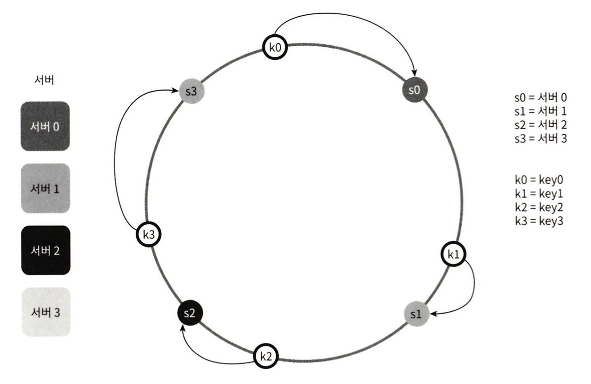
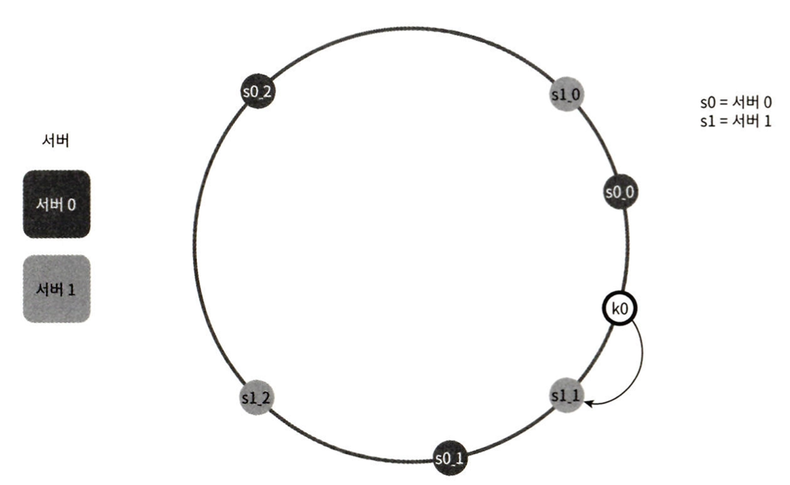

# chapter5. 안정 해시 설계

`요청 또는 데이터를 여러 서버에 균등하게 나누자`

## 해시키 재배치 문제

- serverIndex = hash(key) % N(서버의 개수)
- 서버의 크기가 고정되어 있고 데이터 분포가 균등할때 잘 동작한다.
- 서버가 추가되거나 삭제될 경우 서버 인덱스값이 달라진다. -> 해시키의 재분배로 대규모 캐시 미스가 발생

## 안정해시

- 해시 테이블 크기가 조정될때 평균적으로 `k/n개의 키만 재배치`(k는 키의 개수, n은 슬롯의 개수)
- 해시링 위에 서버와 해시키 키 배치

### 서버 조회

- 해당 키의 위치로 부터 시계방향으로 링을 탐색해 나가면서 첫번째 만나는 서버

### 서버 추가

- 서버를 추가하더라도 키 가운데 일부만 재배치
- s3 와 s0 사이에 s4가 추가된다면, k0의 키만 재배치된다. k0는 s4 서버를 조회한다.

### 서버 삭제

- 서버를 삭제하더라도 키 가운데 일부만 재배치
- s0 서버가 삭제된다면, k0는 s1 서버를 조회한다.

### 기본 구현법의 두가지 문제점

- 서버가 추가 삭제 될때, 파티션(인접한 서버 사이의 해시 공간)의 크기를 균등하게 유지하는 것이 불가능
    - s1의 서버가 삭제된다면 s2의 해시 공간은 다른 파티션 대비 2배로 커진다.
- 키의 균등 분포를 달성하기 어렵다.
    - 키 데이터가 하나의 서버에 유독 많이 몰리는 상황이 있을 수 있다.

### 가상 노드

- 하나의 서버는 링 위에 여러개의 가상 노드를 가질 수 있다.
- 각 서버는 여러개의 파티션을 관리해야 한다.
- 가상 노드의 개수를 늘림으로서 키의 분포는 점점 더 균등해진다.

## 안정 해시의 시점

- 서버의 추가 삭제시 재배치 되는 키의 수 최소화
- 데이터가 보다 균등하게 분포되어, 수평적 규모 확장성을 달성하기 쉽다.
- 핫스팟 키 문제를 줄인다.

## 참조

[가상 면접 사례로 배우는 대규모 시스템 설계 기초](https://www.yes24.com/Product/Goods/102819435)