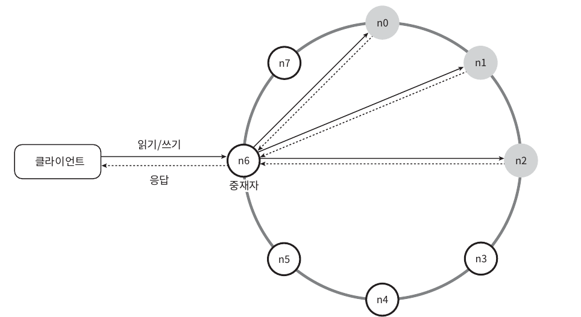

# chapter6. 키-값 저장소 설계

`키-값 데이터베이스라고도 불리는 비 관계형 데이터베이스`

## 문제의 이해 및 설계 범위 확정

- 키-값 쌍의 크기는 10KB 이하이다.
- 큰 데이터를 저장할 수 있어야 한다.
- 높은 가용성을 제공해야 한다. 장애가 있더라도 빨리 응답해야한다.
- 높은 규모의 확장성을 제공해야한다. 트래픽의 양에 따라 자동적으로 서버 증설/삭제가 이루어져야한다.
- 데이터의 일관성 수준은 조정이 가능해야한다.
- 응답 지연시간이 짧아야한다.

## 단일 서버 키-값 저장소

- 키-값 쌍 전부를 메모리에 해시 테이블로 저장
- 고려 사항
    - 데이터 압축
    - 자주 쓰는 데이터만 메모리에 두고 나머지는 디스크에 저장

## 분산 키-값 저장소

### CAP 이론

- 데이터 일관성(consistency), 가용성(availability), 파티션 감내성(partition tolerance)라는 세가지 요구사항을 동시에 만족하는 분산시스템 설계는 불가능하다라는 정리
    - 이들 가운데 어떤 두 가지를 충족하려면 나머지 하나는 반드시 희생되어야 한다.
- 일관성: 모든 클라이언트는 어떤 노드에 접속하든 같은 데이터를 보게 되어야한다.
- 가용성: 클라이언트는 일부 노드에 장애가 발생하더라도 항상 응답을 받을 수 있어야 한다.
- 파티션 감내: 네트워크에 파티션(두 노드 사이에서 발생하는 통신 장애)이 생기더라도 시스템은 계속 동작하여야 한다.
- CP 시스템, AP 시스템, CA 시스템(분산 시스템은 반드시 파티션 문제를 감내 할 수 잇또록 설계해야 한다. 실세계에서는 존재하지 않는다.)

#### 이상적인 상태

> 예시: 분산 서버 n1, n2, n3 있다고 할때 이상적인 상태라면...

- 네트워크 파티션은 절대 일어나지 않는다.
- n1에 기록된 데이터는 자동적으로 n2, n3에 복제 된다.
- 데이터 일관성과 가용성을 만족한다.

#### 실세계의 분산 시스템

> 예시: 분산 서버 n1, n2, n3 있다고 할때, n3에 장애가 발생하여 n1, n2와 통신할수 없다면...

- 파티션 문제가 발생하면 일관성과 가용성 사이에서 하나를 선택해야 한다.
- 일관성 선택
    - 데이터 불일치 문제를 피하기 위해 n1, n2에 대한 쓰기 연산을 중단시켜야 하는데, 그렇게 하면 가용성이 깨진다.
    - 은행권 시스템에서는 항상 최신 정보를 가지고 있어야하므로, 데이터 일관성이 깨질 수 있는 상황이라면, 시스템이 정상적으로 돌아올때까지 오류를 반환한다.
- 가용성 선택
    - 낡은 데이터를 반환할 위험이 있더라도 계속 읽기 연산을 허용해야한다.
    - n1, n2는 계속 쓰기 연산을 허용하고, 파티션 문제가 해결되면 새 데이터를 n3에 전송할 것이다.

### 시스템 컴포넌트

#### 데이터 파티션

- 전체 데이터를 한 서버에 넣는 것은 불가능하다.
- 데이터를 작은 파티션들로 분할하여 여러 서버에 저장하여야 한다.
- 균등한 데이터 분포와 노드가 추가/삭제 될때 키 재배치를 최소화하기 위해 `안정 해시`를 이용할 수 있다.

#### 데이터 다중화

- 가용성과 안정성을 위해 데이터를 N개 서버에 비동기적으로 다중화해야 한다.
- 키를 해시 링위에 배치한 후, 시계 방향으로 순회하며 만나는 N개의 서버에 데이터를 보관한다.
- 안정성을 확보하기 위해서 사본은 다른 센터의 서버에 보관하고, 센터들은 고속 네트워크로 연결한다.

#### 데이터 일관성

- 여러 노드에 다중화된 데이터는 적절히 동기화 되어야 한다.

##### 정족수(Quorum Consensus)의 합 프로토콜

> Note  
> 정족수: 안건에 대한 회의를 진행하거나 최종 결정을 내리기위해 필요한 **최소 인원수**를 사전에 정의해 두는것

- N: 사본개수
- W: 쓰기 연산에 대한 정족수. 쓰기 연산이 성공한다는 것으로 간주되려면 적어도 W개의 서버로부터 쓰기 연산이 성공했다는 응답을 받아야한다.
- R: 읽기 연산에 대한 정족수. 읽기 연산이 성공한다는 것으로 간주되려면 적어도 R개의 서버로부터 응답을 받아야한다.

**W,R,N의 값을 정하는 것은 응답지연과 데이터 일관성 사이의 타협접을 찾는 과정이다.**

- R=1, W=N: 빠른 읽기 연산에 최적화된 시스템
- W=1, R=N: 빠른 쓰기 연산에 최적화된 시스템
- W + R > N: 강한 일관성이 보장됨(일관성을 보증할 최신 데이터를 가진 노드가 최소 하나는 겹친다.)
- W + R <= N: 강한 일관성이 보장되지 않음

#### 일관성 모델

- 강한(strong) 일관성: 모든 읽기 연산은 가장 최신에 갱신된 결과를 반환한다.
- 약한(week) 일관성: 읽기 연산은 가장 최근에 갱신된 결과를 반환하지 못할 수 있다.
- **최종(eventual) 일관성**: 약한 일관성의 한 형태, 갱신 결과가 결국에는 모든 사본에 반영(동기화)되는 모델
    - 쓰기 연산을 할때 데이터 일관이 깨어질 수 있다.
    - 클라이언트 측에서 버전 정보를 활용해 일관성이 깨지 않도록 하는 기법을 사용해야한다. (ex 데이터 버저닝)

#### 데이터 버저닝

- 버저닝과 백터시계를 이용한 비 일관성 해소 기법
- 버저닝
    - 데이터를 변경할 때마다 해당 데이터의 새로운 버전을 만드는 것
    - 각 버전의 데이터는 변경 불가능(immutable)
- 백터 시계
    - \[서버, 버전\]의 순서쌍을 데이터에 매단 것
    - 버전의 선후관계를 알 수 있고, 충돌이 일어났는지 판별할 수 있다.
    - D(\[S1, v1\], \[S2, v2\], ..., \[Sn, vn\]) 같이 표현한다. (D: 데이터, vi 버전 카운터, Si: 서버 번호)
    - \[Si, \vi]가 있으면 vi를 증가시킨다.
    - 그렇지 않으면 새항목 \[Si, \v1]를 만든다.

#### 백터 시계의 추상적 로직

- 두 클라인트가 D2 읽어와 동시에 D2 데이터를 갱신하여 D3, D4 버전을 생성한다.
- 어떤 클라이언트가 D3와 D4를 읽으면 데이터 간 충돌이 있다는 것을 알게 된다.
- 충돌을 감지하고 해소된 데이터를 해소한 후에 서버에 기록한다.
    - 충돌을 해결하기 위해 LWW(Last Write Wins) 방식을 이용한다.
    - LWW: 데이터에 버전백터와 함께 타임스탬프도 저장, 두 개의 버전 중 타임스탬프가 더 최근인 데이터를 선택

#### 백터 시계의 충돌 감지 방법

- 버전 Y에 포함된 모든 구성요소의 값이 X에 포함된 모든 구성요소의 값보다 같거나 크면, 버전 X가 버전 Y의 이전 버전인지 알 수 있다.

> X: D([S0, 1], D([S1, 1])  
> Y: D([S0, 1], D([S1, 2])  

X 는 Y 보다 이전 버전이다.

- 선후 관계를 파악할 수 없으면 충돌이 발생했다고 간주한다.

> X: D([S0, 1], D([S1, 2])  
> Y: D([S0, 2], D([S1, 1])  

#### 벡터 시계의 단점

- 충돌 감지 및 해소 로직이 클라인트에 들어가야 하므로, 클라이언트 구현이 복잡해진다.
- \[서버, \버전]의 순서쌍 개수가 굉장히 빨리늘어난다. 임계치를 설정해 오래된 순서쌍을 제거할 수있지만, 이렇게 하면 선후 관계가 불분명해질 수 있다.

#### 장애 감지

두 대 이상의 서버가 똑같이 서버 A의 장애를 보고해야 해당 서버에 실제 장애가 발생했다고 간주하게 된다.

#### 가시 프로토콜(gossip protocol)

**동작 원리**

- 각 노드는 멤버십 목록을 유지한다. 멤버십 목록은 \[각 멤버 ID, 박동 카운터\]쌍의 목록이다.
- 각 노드는 주기적으로 자신의 박동카운터를 증가시킨다.
- 각 노드는 무작위로 선정된 노드들에게 주기적으로 자기 박동 카운터 목록을 보낸다.
- 박동 카운터 목록을 받은 노드는 멤버십 목록을 최신값으로 갱신한다.
- 어떤 멤버의 박동 카운터 값이 지정된 시간동안 갱신되지 않으면 해당 멤버는 장애 상태인 것으로 간주된다.

#### 일시적 장애 처리

- 엄격한 정족수 접근법
    - 모든 서버의 읽기와 쓰기 연산을 금지한다.
- 느슨한 정족수 접근법(단서 후 임시 위탁(hinted handoff))
    - 장애 상태인 서버로 가는 요청은 다른 서버가 잠시 맡아서 처리, 임시로 쓰기 연산을 처리한 서버에는 단서(hint)를 남긴다.
    - 장애 상태인 서버가 복구되면 hint를 보고 갱신된 데이터를 기록

#### 영구 장애 처리

- 사본들을 비교하여 최신 버전으로 갱신하는 과정(반엔트로피 프로토콜)
- 사본 간의 일관성이 망가진 상태를 탐지하고 전송 데이터의 양을 줄이기 위해 `머클 트리` 사용

**머클 트리**
> 해시트리라고도 불리는 머클트리는 각 노드에 그 자식 노드들에 보관된 값의 해시, 또는 자식 노드들의 레이블로부터 계산된 해시값을 테이블로 붙여두는 트리다. 해시 트리를 사용하면 대규모 자료 구조의 내용을
> 효과적이면서도 보안상 안전한 방법으로 검증할 수 있다.

- 1단계: 키 공간을 4개의 버킷으로 나눔 (예제는 4개)
- 2단계: 버킷에 포함된 각각의 키에 균등 분포 해시 함수를 적용하여 해시 값을 계산한다
- 3단계: 버킷별로 해시값을 계산한 후, 해당 해시 값을 레이블로 갖는 노드를 만든다.
- 4단계: 자식 노드의 레이블로부터 새로운 해시값을 계산하여 이진트리를 상향식으로 구성해나간다.

#### 데이터 센터의 장애

데이터를 여러 센터에 다중화

### 시스템 아키텍쳐 다이어그램

- 클라이언트는 키-값 저장소가 제공하는 API get(key)와 put(key, value)로 통신한다.
- 중재자는 클라이언트에게 키-값 저장소에 대한 프락시 역할을 하는 노드다.
- 노드는 안정해시의 해시링 위에 분포한다.

### 쓰기 경로

- 쓰기 요청을 커밋 로그 파일에 기록한다.
- 데이터를 메모리 캐시에 기록한다.
- 메모리 캐시의 내용을 영구 저장소에 기록한다.

### 읽기 경로

- 메모리 캐시에 데이터가 있는지 확인한다.
- 영구 저장소에 데이터가 있는지 확인한다.

### 요약

## 참조

[가상 면접 사례로 배우는 대규모 시스템 설계 기초](https://www.yes24.com/Product/Goods/102819435)