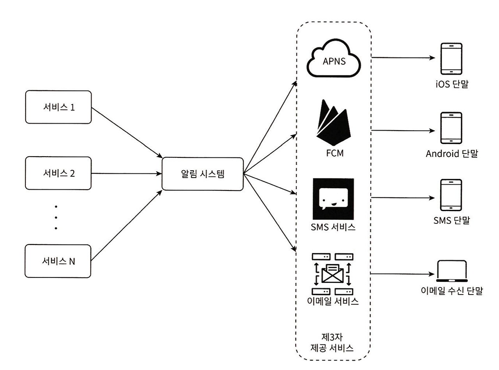
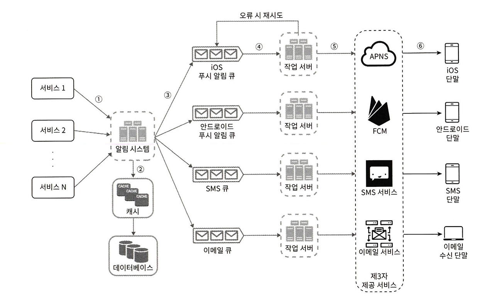
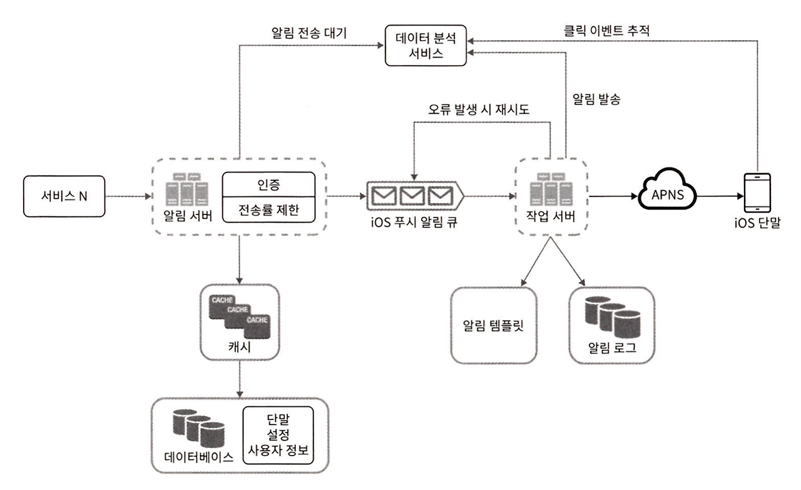

# chapter10. 알림 시스템 설계

## \[1단계\] 문제 이해 및 설계 범위 확정

### 요구사항

- 푸시, SMS, 이메일 알림 지원
- 연성 실시간 시스템: 가능 빨리 전달 되어야하나, 약간의 지연은 허용
- iOS, android, 웹
- 클라이언트 애플리케이션, 서버측 스케쥴링에 의해 알람 메세지를 만들 수 있다.
- 알람 on/off 기능
- 하루에 천만 건의 모바일 푸시 알람, 백만 건의 SMS 메세지, 5백만 건의 이메일 전송 가능

## \[2단계\] 개략적인 설계안 제시 및 동의 구하기

- 알람 유형별 지원 방안
- 연락처 정보 수집 절차
- 알림 전송 및 수신 절차

### 알림 유형별 지원 방안

- iOS: APNS를 통해 알람을 보낸다.
- Android: FCM을 통해 알람을 보낸다.
- 이메일: 직접 이메일 서버를 구축할 수있지만, 상용 이메일 서비스를 많이 이용한다.
    - 상용 이메일 서비스는 전송 성공률도 높고, 데이터 분석 서비스도 제공한다.

### 연락처 정보 수집 절차

- 알람을 보내려면 모바일 단말 토큰, 전화번호, 이메일 주소등의 정보가 필요하다.
- 앱을 설치하거나 게정을 등록 할때, 사용자 정보를 수집하여 데이터 베이스 저장한다.

### 알림 전송 및 수신 절차

#### 개략적 설계안(초안)

- 1 부터 N 까지의 서비스: 알림 요청
- 알림 시스템: 서비 1~N에 알림 전송을 위한 API 제공, 제3자 서비스에 전달할 알림 페이로드를 만든다.
- 제3자 서비스: 실제 알림을 전달하는 역할, 쉽게 서비스를 통합하거나 제거할 수 있어야 한다.(확장성 고려)

##### 설계의 문제점

하나의 알림 서버를 가지기 때문에...

- 단일 장애 지점(SPOF)이 된다.
- 데이터베이스나 캐시 등 규모 확장에 취약하다.
- 트래픽이 많이 몰리는 시간에는 시스템 과부하 상태가 발생할 확률이 높아진다.

#### 개략적인 설계안(개선된 버전)

- 데이터 베이스와 캐시를 알림 시스템의 주 서버에서 분리
- 알림 서버를 증설하고 수평적 확장이 이루어지도록 변경
- 메세지 큐를 이용해 시스템 컴포넌트 사이의 강한 결합 제거

##### 컴포넌트의 기능

- 캐시: 사용자 정보, 단말 정보, 알람 템플릿을 캐시
- 데이터 베이스: 사용자, 알림, 설정 등 다양한 정보 저장
- 메시지 큐: 시스템 컴포넌트 간 의존 제거, 다량의 알람이 전송되어야 하는 경우를 대비한 버퍼 역할
- 작업 서버: 메시지 큐에서 전송할 알림을 꺼내 제3자 서비스로 전달

## \[3단계\] 상세 설계

- 안정성
- 추가 컴포넌트: 알림 템플릿, 알림 설정, 전송률 제한, 제시도 메커니즘, 보안, 큐 모니터링, 이벤트 추적

### 안정성

#### 데이터 손실 방지

- 어떤 상황에도 알림이 소실되면 안된다.
- 알림 데이터(알림 로그)를 데이터 베이스에 보관하고 재시도 매커니즘 구현

#### 알림 중복 전송 방지

- 분산 시스템에서 중복을 막는것은 불가능하지만 중복 빈도는 줄일수 있다.
- 중복 탐지 매커니즘: 알림의 이벤트 ID를 검사하여 이전에 보낸적이 있는 알림인지 판단

### 추가 컴포넌트

#### 알림 템플릿

인자(parameter), 스타일, 추적 링크(tracking link)를 조정 하기만 하면 사전에 지정된 형식에 맞춰 알람을 만들어 내는 틀

#### 알림 설정

(user_id bigint, channel varchar, opt_in boolean) 형태의 테이블로 데이터 베이스에서 관리

#### 전송률 제한

한 사용자가 받을 수 있는 알림의 빈도 제한

#### 재시도 방법

제3자 서비스가 알림 전송에 실패 -> 재시도 전용 큐에 넣는다, 실패 빈도가 잦으면 개발자에게 통지

#### 푸시 알림과 보안

인증된 클라이언트만알림 전송 API를 사용하여 알림을 보낼 수 있다.

#### 큐 모니터링

- 큐에 쌓인 알림의 개수를 바탕으로 서버 추가/제거 고려

#### 이벤트 추적

- 데이터 분석 서비스와 통합하여 알림 확인율, 클릭률, 실제 앱 사용으로 이어지는 비율 등 유의미한 매트릭 정보를 추적하자.
- 알림이 만들어 진 후 성공적으로 전송되기까지의 과정을 추적
    - 발송 대기, 알림 발송, 클릭

### 수정된 설계안

#### 추가 컴포넌트

- 알림 서버에 인증 기능
- 전송률 제한 기능
- 전송 실패에 대응하는 재시도 기능
- 알림 템플릿
- 모니터링
- 추적 시스템

## 참조

[가상 면접 사례로 배우는 대규모 시스템 설계 기초](https://www.yes24.com/Product/Goods/102819435)