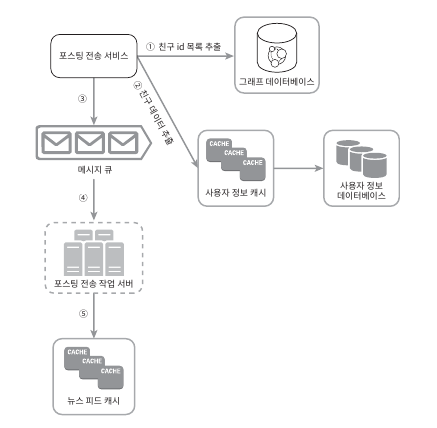

# chapter11. 뉴스 피드 시스템 설계

## \[1단계\] 문제 이해 및 설계 범위 확정

### 요구사항

- 모바일 앱, 웹 지원
- 피드 발행 및 피드 읽기 기능 지원
- 피드는 시간 흐름 역순으로 정렬
- 한명의 사용자는 최대 5000명의 친구를 가질 수 있다.
- 스토리에는 미디어 파일 지원

## \[2단계\] 개략적 설계안 제시 및 동의 구하기

- 피드 발행: 스토리 포스팅 -> 캐시와 DB 저장, 새 포스팅은 친구의 뉴스피에 전송
- 피드 생성: 뉴스피드는 포스팅을 시간 흐름 역순으로 정렬하여 표시

### 피드 발행

- 포스팅 저장 서비스: 새 포스팅을 데이터베이스와 캐시에 저장
- 포스팅 전송 서비스: 새 포스팅을 친구의 뉴스피드에 푸시한다. 뉴스피드 데이터는 캐시에 보관
- 알림 서비스: 친구들에세 새 포스팅이 올라왔을때 푸시 알림을 보낸다.

### 뉴스 피드 생성

- 뉴스 피드 서비스: 캐시에서 뉴스 피드를 가져온다.
- 뉴스 피드 캐시: 뉴스 피드를 랜더링할 때 필요한 피드 ID를 보관한다.

## \[3단계\] 상세 설계

### 피드 발행

### 웹서버

인증, 처리율 제한 기능을 수행한다.

### 포스팅 전송(fanout) 서비스

팬아웃: 어떤 사용자의 새 포스팅을 그 사용자의 팔로어에게 전달하는 과정

#### 쓰기 시점 팬아웃(fanout-on-write, push 모델)

- 새로운 포스팅을 기록하는 시점에 뉴스 피드를 갱신
- 포스팅 시점에 친구의 목록을 가져오고 그 목록에 있는 사용자 모두의 피드를 갱신

##### 장점

- 뉴스 피드가 실시간으로 갱신되며 친구 목록에 있는 사용자에게 즉시 전송된다.
- 포스팅이 쓰이는 시점에 전송되므로 뉴스 피드를 읽는 데 드는 시간이 짧아진다.

##### 단점

- 친구가 많은 사용자의 경우 뉴스 피드 갱신에 많은 시간이 소요될 수 있다.(핫키 문제)
- 서비스를 자주 이용하지 않는 사용자의 피드까지 갱신해야므로 컴퓨팅 자원이 낭비된다.

#### 읽기 시점 팬아웃(fanout-on-read, pull 모델)

- 피드를 읽어야 하는 시점에 뉴스 피드를 갱신

##### 장점

- 비활성화된 사용자 또는 서비스에 거의 로그인하지 않은 사용자에게 피드가 갱신되지 않으므로 컴퓨팅 자원을 아낄 수 있다.
- 데이터를 친구 목록의 사용자 모두에게 푸시하는 작업이 필요 없으므로 핫키 문제도 발생하지 않는다.

##### 단점

- 뉴스 피드를 읽는데 많은 시간이 소요될 수 있다.

### 절충안

- 대부분의 사용자에 대해서는 푸시모델을 사용
- 팔로어가 많은 사용자의 경우에는 팔로어로 하여금 해당 사용자의 포스팅을 필요할 때 가져가도록 하는 풀모델을 사용

### 팬아웃 서비스 동작 방식

1. 그래프 데이터베이스에서 친구 ID 목록을 가져온다.
2. 사용자 정보 캐시에서 친구들의 정보를 가져와 사용자 설정에 따라 친구 가운데 일부를 걸러낸다.
3. 친구 목록과 포스팅 ID를 메시지 큐에 넣는다.
4. 팬아웃 작업서버가 메시지 큐에서 데이터를 뉴스 피드 캐시에 넣는다.
    - 뉴스 피드 캐시는 \<포스팅 ID, 사용자 ID\>의 순서쌍을 보관하는 매핑 테이블

### 뉴스 피드 생성

뉴스 피드 서비스는 뉴스 피드 캐시에서 포스팅 ID 목록을 가져온다.  
포스팅 ID를 바탕으로 사용자 캐시와 포스팅 캐시를 통해 포스팅을 랜더링한다.

### 캐시 구조

- 뉴스 피드: 뉴스피드의 ID를 보관한다.
- 콘텐츠: 포스팅 데이터를 보관하고 인기 콘텐츠는 따로 보관한다.
- 소셜 그래프: 사용자 간 관계 정보를 보관한다.
- 행동: '좋아요'나 댓글 같은 사용자 행위에 관한 정보를 보관한다.
- 횟수: '좋아요' 횟수, 응답 수, 팔로워 수, 팔로잉 수 등의 정보를 보관한다.

## \[4단계\] 마무리

### 추가로 고려해볼만한 사항

- 데이터 베이스 규모 확장
- 웹 계층을 무상태로 운영하기
- 가능한 한 많은 데이터를 캐시할 방법
- 여러 데이터 센터를 지원할 방법
- 메시지 큐를 사용하여 컴포넌트 사이의 결합도 낮추기
- 핵심 메트릭에 대한 모니터링
    - 트래픽이 몰리는 시간대의 QPS
    - 사용자 피드를 새로고침할 때의 지연시간

## 참조

[가상 면접 사례로 배우는 대규모 시스템 설계 기초](https://www.yes24.com/Product/Goods/102819435)