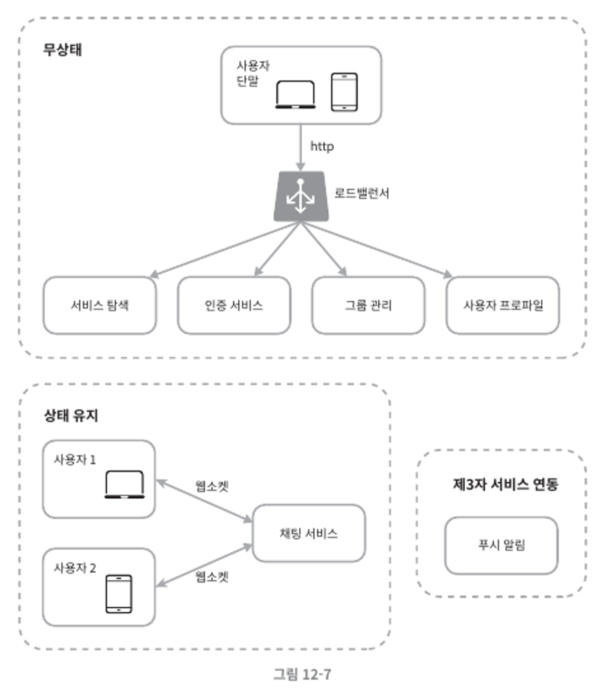
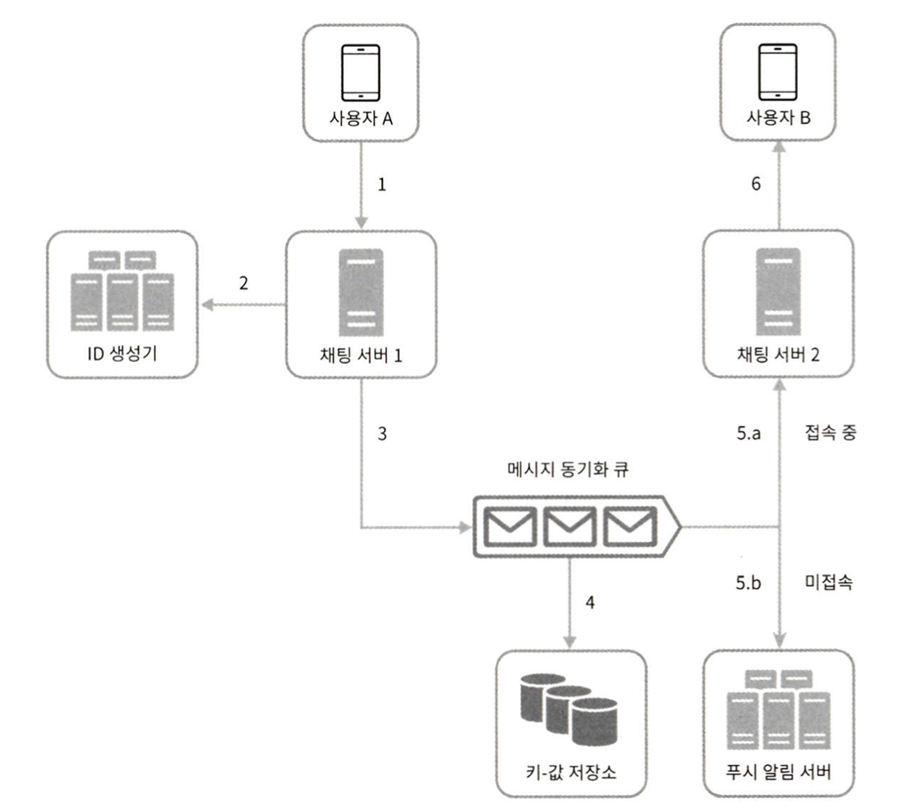
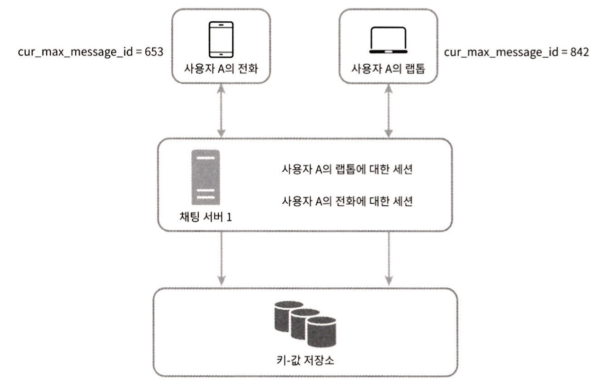
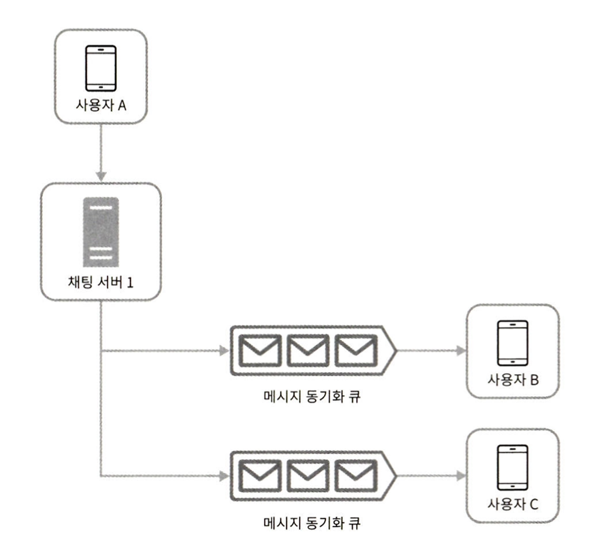
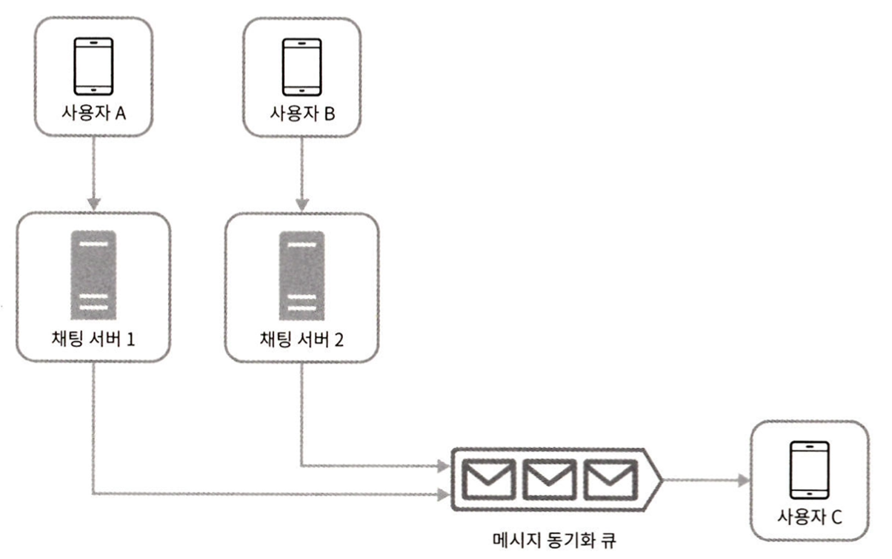

# chapter12. 채팅 시스템 설계

## \[1단계\] 문제 이해 및 설계 범위 확정

### 요구 사항

- 1:1 채팅과 그룹 채팅을 둘다 지원하는 시스템
- 트래픽 규모: DAU 5000만명
- 그룹 채팅은 최대 100명까지 참가 가능
- 사용자 접속 상태 표시 지원
- 메세지 길이는 100,000자 이하
- 채팅 이력은 영원히 보관

## \[2단계\] 개략적 설계안 제시 및 동의 구하기

### 클라이언트와 서버의 통신 방법

- HTTP, WebSocket을 이용한 통신

#### 폴링

- HTTP 통신
- 클라이언트가 주기적으로 서버에게 새 메시지가 있는지 확인하는 방법
- 답해줄 메세지가 없는 경우에는 서버 자원이 불필요하게 낭비된다.

#### 롱 폴링

- 클라이언트는 새 메시지가 반환되거나 타임아웃 될 때까지 연결을 유지
- 새 메시지를 받으면 기존 연결을 종료하고 다시 연결
- 약점
    - 로드밸런싱을 위해 라운드 로빈 알고리즘을 사용할 경우, 메세지 전송 클라이언트와 메세지 수신 클라이언트가 항상 같은 서버에 접속하지 않는다.
    - 서버 입장에서 클라인트가 연결을 해제 했는지 알 좋은 방법이 없다.
    - 메세지를 받지 않는 클라이언트도 타임아웃이 일어날때마다 서버에 다시 접속해야 하낟.

#### 웹소켓

- 서버가 클라이언트에게 비동기(async) 메시지를 보낼때 가장 널리 사용하는 기술
- 한번 맺어진 연결은 영구적이고 양방향이다.
- 처음에는 HTTP 연결이지만 특정 핸드셰이크 절차를 거쳐 웹소켓 연결로 업그레이드 된다.
- HTTP(80), HTTPS(443) 포트를 사용하여 연결

### 개략적 설계안

- 무상태 서비스
- 상태 유지 서비스
- 제 3자 서비스 연동

#### 무상태 서비스

- 로그인, 회원 가입, 사용자 프로필 표시 등을 처리하는 전통적인 요청/응답 서비스
- 서비스 탐색 서비스(service discovery): 클라이언트가 접속할 채팅 서버의 DNS 호스트명을 클라이언트에게 알려주는 역할을 한다.

#### 상태 유지 서비스

- 채팅 서비스
- 각 클라이언트가 채팅 서버와 독립적인 네트워크 연결을 유지해야 한다.
- 각 클라이언트는 항상 동일 서버에 연결되어야한다.

#### 제 3자 연동 서비스

- 푸시 알람: 클라이언트가 서버에 접속하지 않으면 알람을 받을 수 있다.

#### 개략적인 설계안

- 채팅 서버: 클라이언트 사이에 메시지를 중계
- API 서버: 로그인, 회원 가입, 사용자 프로필 표시 등 그외 나머지 요청 처리
- 알림 서버: 푸시 알람
- 키-값 저장소: 채팅 이력 보관

#### 저장소

##### 채팅 이력 데이터의 특징

- 채팅 이력 데이터의 양은 엄청나다.
- 빈번하게 사용되는 데이터는 최근에 주고 받은 메세지다.
- 검색, 언급(mention), 점프(jump) 등 무작위적인 데이터 접근 가능
- 읽기:쓰기 비율이 1:1

이러한 특징을 고려하면 키-값 저장소가 적당하다.

##### 키-값 저장소의 특징

- 수평적 규모 확장 유리
- 데이터 접근 지연시간이 낮다.
- 관계형 데이터 베이스는 인덱스가 커지면 데이터에 대한 무작위 접근 비용이 크다
- 이미 많은 안정적인 채팅 시스템에서 사용하고 있다.

##### 데이터 모델

- 1:1 채팅을 위한 메세지 테이블: message_id 를 키본키로 한다.
- 그룹 채팅 위한 메세지 테이블: (group_id, message_id)의 복합키를 기본키로 한다.
- 메세지 ID (message_id)
    - 고유한 값
    - 시간 순서 보장
    - 스노플레이크, 지역적 순서 번호 생성기 이용

## \[3단계\] 상세 설계

### 서비스 탐색

- 클라언트 위치, 서버의 용량을 기준으로 **클라이언트에게 가장 적합한 채팅 서버를 추천**
- 널리 쓰이는 오픈 소스 솔루션은 아파치 주키퍼

### 메세지 흐름

#### 1:1 채팅 메세지 처리 흐름

1. 사용자 A가 채팅 서버 1로 메시지 전송
2. 채팅 서버 1은 ID 생성기를 사용해 메시지 ID를 결정
3. 해당 메시지를 메시지 동기화 큐로 전송
    - 메세지 동기화 큐는 사용자 B에 귀속된 것인가?
4. 메시지가 키-값 저장소에 보관됨
5. (a) 사용자 B가 접속 중인 경우 B가 사용 중인 채팅 서버로 메시지 전송 (b) 사용자 B가 접속 중이 아니라면 푸시 알림 서버로 푸시 알림 메시지 전송
6. 사용자 B와 채팅 서버 사이에 연결된 웹소켓을 통해 메시지 전송

#### 여러 단말 사이의 메세지 동기화

##### 새 메시지

- 수신자 ID가 현재 로그인한 사용자 ID와 같다.
- 키-값 저장소에 보관된 메세지로서, 그 ID가 cur_max_message_id보다 크다.

cur_max_message_id 를 단말마다 별도로 관리

#### 소규모 그룹 채팅에서의 메세지 흐름

##### 송신자 관점

- 사용자 A가 보낸 메세지가 사용자 B, C의 메시지 동기화 큐에 복사된다.
- 하지만 많은 사용자를 지원해야 하는 경우는 똑같은 메세지를 모든 큐에 복사하는것은 바람직하지 않다.

##### 수신자 관점

여러 사용자로 부터 오는 메세지를 메시지 동기화 큐로 수신할 수 있다.

### 접속 상태 표시

접속 상태 서버는 클라이언트와 웹소켓으로 통신하는 실시간 서비스

#### 사용자 로그인

사용자와 실시간 서비스 사이에 연결이 이루어지면 접속상태 서버는 사용자의 상태와 last_active_at 타임스탬프를 키-값 저장소에 보관한다.

#### 사용자 로그아웃

키-값 저장소에 보관된 사용자 상태를 online 에서 offline 으로 변경

#### 접속 장애

짧은 시간 동안 인터넷 연결이 끊어 졌다 복구 되는 상황처럼 접속이 불안정한 상태일때...

클라이언트가 주기적으로 박동(heartbeat) 이벤트를 접속상태 서버로 전송하고, 마지막 이벤트를 받은 지 x초 이내에 또 다른 박동 이벤트를 받는다면 접속 상태를 유지시키는 방법으로 해결

#### 상태 정보의 전송

##### 그룹의 크기가 작을 때

- 각각의 친구관계마다 채널을 하나씩 둔다.
- 접속 상태가 변경될 시 모든 체널에 접속 메세지를 보낸다.

##### 그룹의 크기가 클 때

그룹의 크가가 크면 채널의 수가 많아지고, 이를 통해 보내는 이벤트 메세지도 커지게 되므로 성능 문제 발생

- push 방식이 아닌 사용자가 그룹 채팅에 입장 했을 때 상태 정보를 pull(읽는) 방식으로 해결
- 접속 상태 수동 갱신으로 해결

## \[4단계\] 마무리

### 부가적으로 고려할 것

- 채팅 메시지에 미디어 지원
- 메세지 전송시 종단 간 암호화
- 읽은 메시지에 대해 캐시를 도입
- 사용자의 데이터, 채널 등을 지역적으로 분산하는 네트워크를 구축
- 오류 처리
    - 채팅 서버 오류
    - 메시지 재전송

## 참조

[가상 면접 사례로 배우는 대규모 시스템 설계 기초](https://www.yes24.com/Product/Goods/102819435)